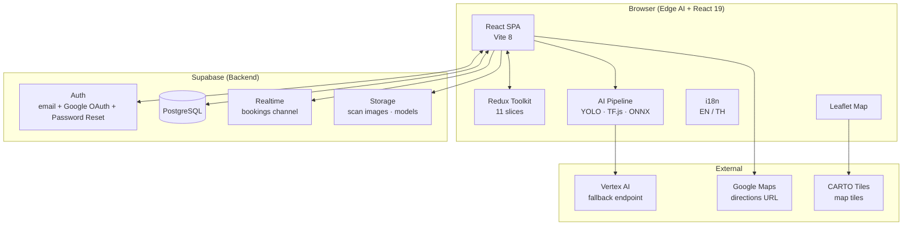
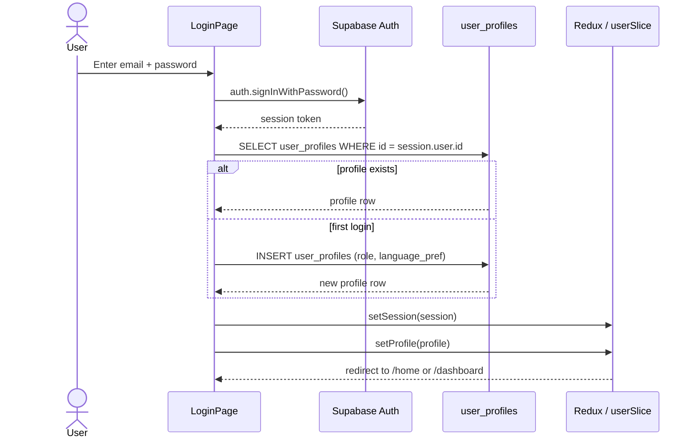
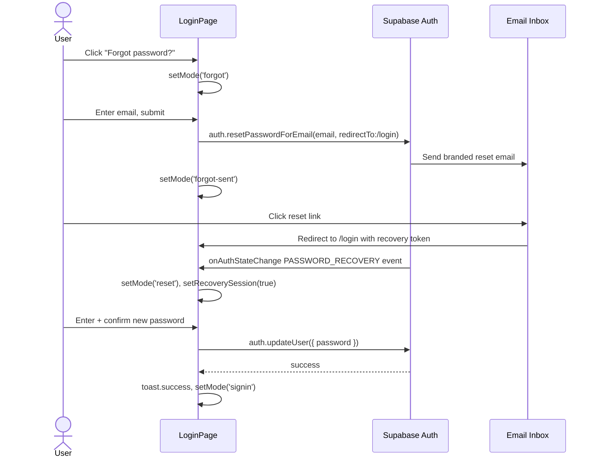
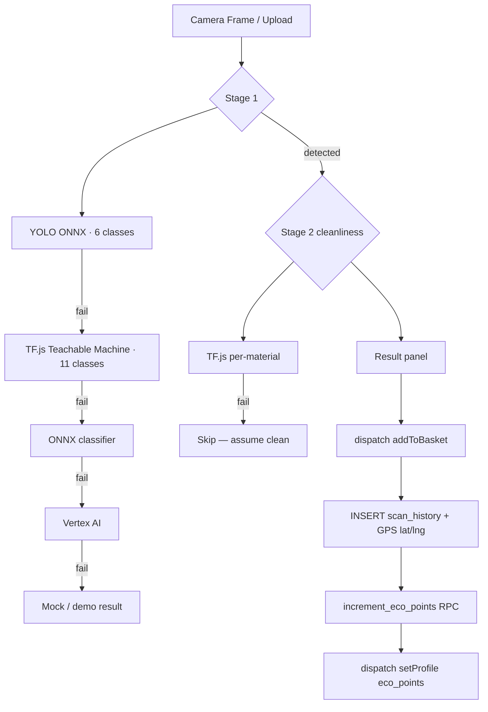
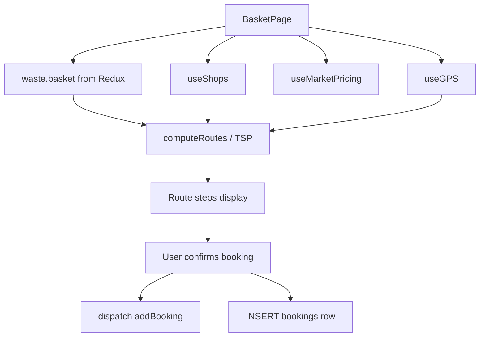

# GreenPlus AI — Feature Inventory & Dataflow
16 May 2026 (16 พฤษภาคม 2569)

> Single-file reference for every feature in the project: what exists, what is partial, what is missing, and how data moves through each one.

---

## Status Legend

| Symbol | Meaning |
|--------|---------|
| ✅ | Fully built — production-ready |
| ⚠️ | Partially built — core works, gaps remain |
| 🔴 | UI only — no backend integration |
| ❌ | Deleted or not yet started |

---

## System Architecture Overview

---

## Feature 1 — Authentication & Session ✅

**Route:** `/login`
**Role:** Public

### What it does
- Email + password sign-up and sign-in
- Google OAuth via Supabase
- Role assignment on first sign-up (`user` / `buyer` / `admin`)
- Email verification resend
- **Forgot password flow** — sends branded reset email, detects `PASSWORD_RECOVERY` event, shows set-new-password form with strength bar
- Auto-redirect when session is already active
- `useAuth()` hook initialises session and profile into Redux on every page load

### Dataflow

### Forgot-password dataflow

---

## Feature 2 — Landing Page ✅

**Route:** `/`
**Role:** Public

### What it does
- Hero with animated particle background
- Role selector (User / Buyer) linking to `/login`
- Live active-buyer count queried from `shops` table
- Live global stats: total kg recycled and total ฿ paid out aggregated from `scan_history` and `bookings` via Supabase
- Auto-redirects authenticated users to their role's home

---

## Feature 3 — Home Page ✅

**Route:** `/home`
**Role:** User

### What it does
- Greeting (Bangkok timezone-aware: morning / afternoon / evening)
- KPI strip: weekly kg recycled, estimated ฿ earnings, pending payout
- 7-day hatch bar chart (custom SVG, weight per day)
- Quick-action buttons (Scan, Marketplace, Map, Nearby Buyer)
- Recent scans list (last 5 basket items)
- Nearby buying requests (top 3 shops with material prices)
- Live "last refresh" timestamp initialised at mount; payout shown only when basket is non-empty

---

## Feature 4 — 2-Stage AI Scanner ⚠️

**Route:** `/scan`
**Role:** User

### What it does
- Camera viewfinder with image-upload fallback for desktop
- Stage 1 — Material classification; Stage 2 — Cleanliness scoring (Clean / Dirty)
- Result panel with confidence %, material name, price estimate, handling guide rules
- Dirty-item alert modal; batch queue; misidentification report modal; anti-troll detection

### What is missing
- Flash control and multi-camera select

### Inference fallback chain

---

## Feature 5 — Smart Basket & Route Planner ✅

**Route:** `/basket`
**Role:** User

### What it does
- Item cards: edit weight, toggle clean/dirty, skip or remove
- Manual add panel
- Single-shop route + Multi-stop TSP route (Nearest-Neighbor algorithm)
- Price comparison vs market average; booking modal

### Dataflow

---

## Feature 6 — Smart Map ✅

**Route:** `/map`
**Role:** User

Green pins = shops accepting basket materials, grey = not. Shop popup with hours, distance, directions link to Google Maps.

---

## Feature 7 — Marketplace ⚠️

**Route:** `/marketplace`
**Role:** All authenticated

Pricing table, active shops sidebar, Post Ad form with GPS. CSV export downloads `shopPricing` data as a `.csv` file. Price alerts are still a UI stub.

### What is missing
- Price alert subscription (email/push when material price crosses threshold)

---

## Feature 8 — Buyer Dashboard ⚠️

**Route:** `/dashboard`
**Role:** Buyer

Orders tab (accept/reject/complete), Calendar tab, Materials tab. Calendar and materials saves persist to Redux/localStorage only — Supabase UPDATE not called.

### What is missing
- Calendar open-days → persist to `user_profiles.open_days`
- Materials tab → persist to `user_profiles.accepted_materials`

---

## Feature 9 — Schedule Page ✅

**Route:** `/schedule`
**Role:** Buyer

Today's bookings grouped by Morning / Afternoon / Evening. Full status lifecycle (confirm / complete / cancel).

---

## Feature 10 — Pricing Page ⚠️

**Route:** `/pricing`
**Role:** Buyer

8 materials × 2 grades (Clean/Dirty), editable inputs, market-rate colour coding. Save persists to Redux/localStorage only — `shop_pricing` Supabase table not updated.

### What is missing
- Save handler → `UPSERT shop_pricing` for the buyer's shop

---

## Feature 11 — Notifications ✅

**Route:** `/notifications`
**Role:** All authenticated

Notification cards (new_order, price_alert, order_completed, flagged_item, system). Mark read / dismiss with Supabase sync. `useRealtimeNotifications` hook loads persisted notifications on mount, subscribes to bookings INSERT filtered by `shop_id`, INSERTs to DB on arrival, syncs read/dismiss back. `notifications` table created by migration 009.

---

## Feature 12 — Admin Panel ✅

**Route:** `/admin`
**Role:** Admin

| Tab | Status |
|-----|--------|
| AI Studio | ✅ Upload/activate models, model registry |
| Reports | ⚠️ Lists misidentification reports; approve handler incomplete |
| Moderation | ✅ Flag/remove posts written to `marketplace_posts.flagged` (migration 010) |
| Shops | ✅ Fetches pending shops from DB; approve/reject writes `shops.status` |
| Heatmap | ✅ Live Leaflet map of scan locations (CircleMarkers from `scan_history` lat/lng) |

---

## Feature 13 — Settings ⚠️

**Route:** `/settings`
**Role:** All authenticated

Language + dark mode fully working. Notification preference toggles persist to `user_profiles.notification_prefs` JSONB (migration 011). "Export my data" downloads JSON of scan_history + bookings. "Delete account" button is present but has no handler.

### What is missing
- Delete account → `supabase.auth.admin.deleteUser` + cascade profile delete

---

## Feature 14 — Profile Page ✅

**Route:** `/profile`
**Role:** All authenticated (role-branched UI)

User: scan history table. Buyer: accepted-materials save → Supabase. Admin: stats grid with live queries (pending shops, active shops, flagged posts).

---

## Feature 15 — Waste Handling Rules ✅

**Data:** `src/data/wasteRules.js`
**Shown in:** ScanPage Live Analysis panel

4 severity levels per material: 🔴 reject · 🟡 warning · ⚪ info · 🔵 dispose. All 8 materials covered.

---

## Feature 16 — Supabase Realtime Notifications ✅

**Hook:** `src/hooks/useRealtimeNotifications.js`

Subscribes to `bookings` INSERT events filtered by `shop_id=eq.{shop.id}` (buyer only). On arrival: INSERTs notification row to DB, dispatches `addNotification` with DB UUID. On mount: loads last 50 notifications from `notifications` table. Mark-read and dismiss sync back to Supabase.

---

## Feature 17 — Dark Mode ✅

Full token-based dark-mode with system-preference detection, localStorage persistence, CSS `dark` class on `<html>`.

---

## Feature 18 — Internationalisation EN / TH ✅

`useT()` hook, auto-detected from `navigator.language`, all 8 material names and all page strings translated.

---

## Feature 19 — GPS & Haversine Distance ✅

`useGPS()` + `haversine.js` used by BasketPage (routing), MapPage (markers), MarketplacePage (ad location). GPS captured non-blocking on each scan and stored as `lat`/`lng` in `scan_history` (migration 011).

---

---

## Complete Feature Status Table

| # | Feature | Route | Role | Status | Key missing piece |
|---|---------|-------|------|--------|-------------------|
| 1 | Auth + Forgot Password | `/login` | Public | ✅ | — |
| 2 | Landing Page | `/` | Public | ✅ | — |
| 3 | Home Page | `/home` | User | ✅ | — |
| 4 | 2-Stage AI Scanner | `/scan` | User | ⚠️ | Flash, multi-camera select |
| 5 | Smart Basket + TSP Routing | `/basket` | User | ✅ | — |
| 6 | Smart Map | `/map` | User | ✅ | — |
| 7 | Marketplace | `/marketplace` | All | ⚠️ | Price alert subscriptions |
| 8 | Buyer Dashboard | `/dashboard` | Buyer | ⚠️ | Calendar/materials → Supabase |
| 9 | Schedule Page | `/schedule` | Buyer | ✅ | — |
| 10 | Pricing Page | `/pricing` | Buyer | ⚠️ | Save → shop_pricing table |
| 11 | Notifications | `/notifications` | All | ✅ | — |
| 12 | Admin Panel | `/admin` | Admin | ⚠️ | Reports approve handler |
| 13 | Settings | `/settings` | All | ⚠️ | Delete account handler |
| 14 | Profile Page | `/profile` | All | ✅ | — |
| 15 | Waste Handling Rules | ScanPage | User | ✅ | — |
| 16 | Supabase Realtime | hook | Buyer | ✅ | — |
| 17 | Dark Mode | Settings | All | ✅ | — |
| 18 | Internationalisation EN/TH | global | All | ✅ | — |
| 19 | GPS + Haversine + Scan Location | BasketPage/MapPage/ScanPage | User | ✅ | — |
| 20 | Eco-Points / Gamification | — | — | ❌ | Removed — not planned |

---

## Redux Slice Summary

| Slice | Key State | Persistence |
|-------|-----------|-------------|
| `user` | session, profile (incl. eco_points), language, darkMode | `gp_dark` localStorage |
| `waste` | basket[], lastScan | in-memory only |
| `bookings` | bookings[] | in-memory only |
| `marketplace` | posts[] | in-memory only |
| `aiConfig` | model URLs, thresholds, version | `gp_ai_config` localStorage |
| `buyer` | openDays, acceptedMaterials | `buyer_settings` localStorage |
| `schedule` | slots[] | in-memory only |
| `notifications` | items[] | Supabase `notifications` table |
| `pricing` | prices{}, savedAt | `gp_pricing` localStorage |

---

## Supabase Table Access Map

| Table | Read | Write | Status |
|-------|------|-------|--------|
| `shops` | Map, Basket, Marketplace, Admin, Landing | Admin approve/reject | ✅ |
| `bookings` | Dashboard, Schedule | Basket | ✅ |
| `user_profiles` | Login, Profile, Dashboard, Settings | Login, Profile, Settings, useScanInsert (eco_points via RPC) | ✅ |
| `scan_history` | Profile, EcoPointsPage, Admin Heatmap | useScanInsert (incl. lat/lng) | ✅ |
| `user_reports` | Admin | ScanPage | ✅ |
| `marketplace_posts` | Marketplace, Admin Moderation | Marketplace, Admin (flag/remove) | ✅ |
| `model_registry` | Admin | Admin | ✅ |
| `shop_pricing` | Marketplace, Pricing | Pricing (❌ save not wired) | ⚠️ |
| `notifications` | NotificationsPage (on mount) | useRealtimeNotifications | ✅ |

## Supabase Migrations Applied

| # | File | What it adds |
|---|------|-------------|
| 001–008 | baseline | core tables: users, shops, bookings, scan_history, marketplace_posts, model_registry, shop_pricing |
| 009 | `009_notifications_table.sql` | `notifications` table + RLS |
| 010 | `010_marketplace_flagged.sql` | `marketplace_posts.flagged boolean` + index |
| 011 | `011_settings_scan_location.sql` | `user_profiles.notification_prefs jsonb`, `scan_history.lat/lng double precision` |
| 012 | `012_eco_points_fn.sql` | `increment_eco_points` function — **removed from codebase, do not apply** |

---

*Updated 16 May 2026 — reflects PRs #42–#45.*
