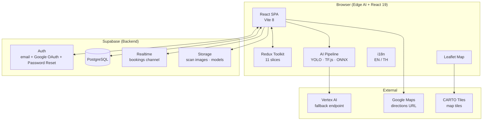
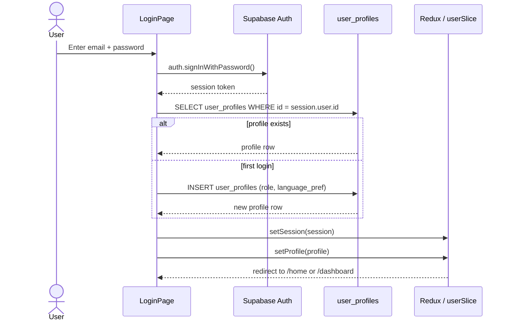
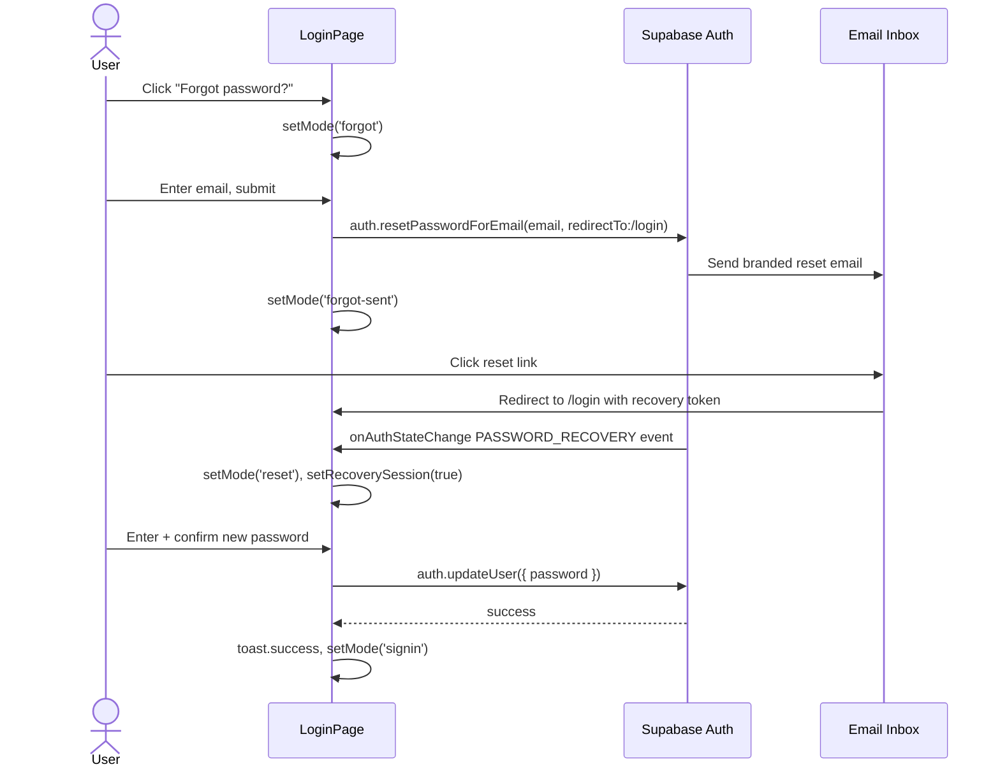
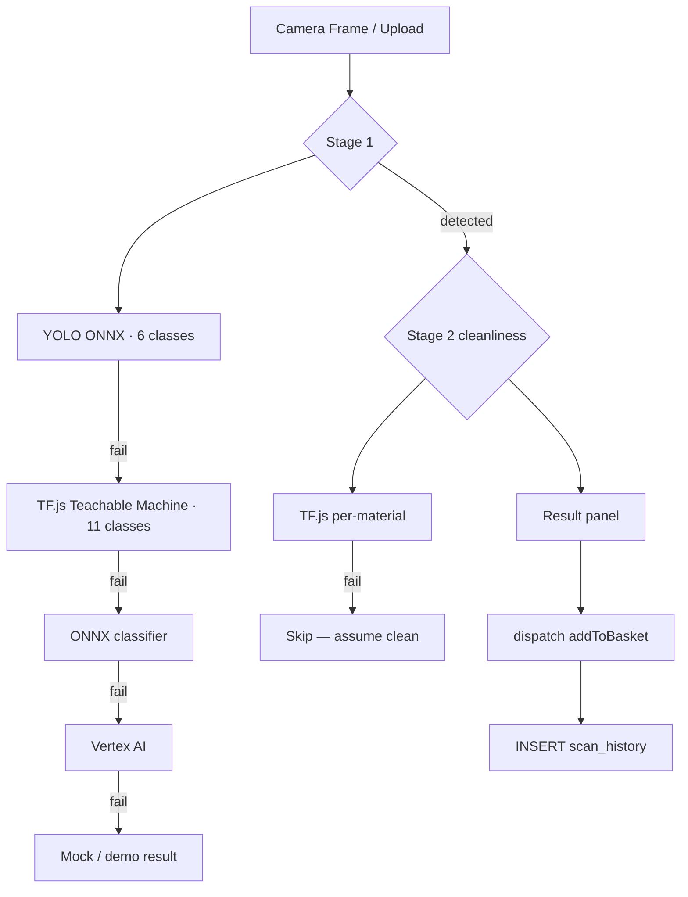
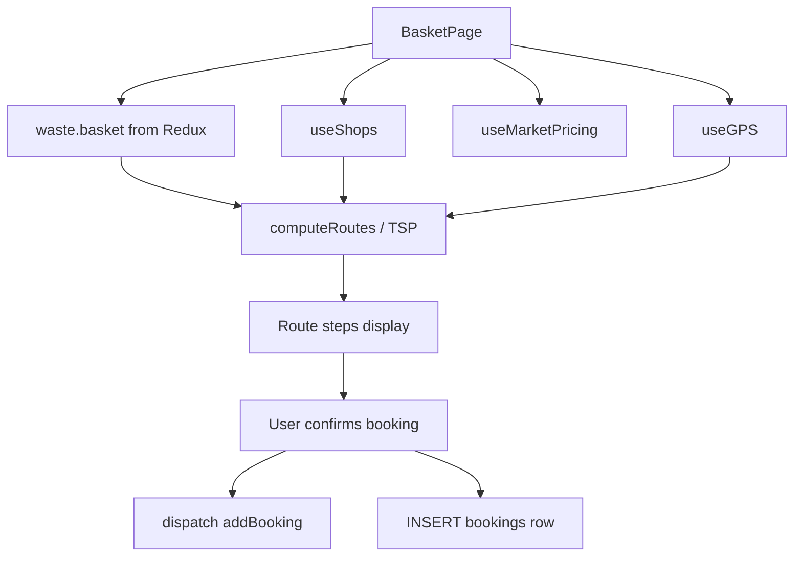

# GreenPlus AI — Feature Inventory & Dataflow
16 May 2026 (16 พฤษภาคม 2569)

> Single-file reference for every feature in the project: what exists, what is partial, what is missing, and how data moves through each one.

---

## Status Legend

| Symbol | Meaning |
|--------|---------|
| ✅ | Fully built — production-ready |
| ⚠️ | Partially built — core works, gaps remain |
| 🔴 | UI only — no backend integration |
| ❌ | Deleted or not yet started |

---

## System Architecture Overview

---

## Feature 1 — Authentication & Session ✅

**Route:** `/login`  
**Role:** Public

### What it does
- Email + password sign-up and sign-in
- Google OAuth via Supabase
- Role assignment on first sign-up (`user` / `buyer` / `admin`)
- Email verification resend
- **Forgot password flow** — sends branded reset email, detects `PASSWORD_RECOVERY` event, shows set-new-password form with strength bar
- Auto-redirect when session is already active
- `useAuth()` hook initialises session and profile into Redux on every page load

### Dataflow

### Forgot-password dataflow

---

## Feature 2 — Landing Page ⚠️

**Route:** `/`  
**Role:** Public

### What it does
- Hero with animated particle background
- Role selector (User / Buyer) linking to `/login`
- Live active-buyer count queried from `shops` table
- Auto-redirects authenticated users to their role's home

### What is missing
- Global stats ("— kg recycled", "— total paid out") are hardcoded — need aggregation from `scan_history` and `bookings`

---

## Feature 3 — Home Page ⚠️

**Route:** `/home`  
**Role:** User

### What it does
- Greeting (Bangkok timezone-aware: morning / afternoon / evening)
- KPI strip: weekly kg recycled, estimated ฿ earnings, pending payout
- 7-day hatch bar chart (custom SVG, weight per day)
- Quick-action buttons (Scan, Marketplace, Map, Nearby Buyer)
- Recent scans list (last 5 basket items)
- Nearby buying requests (top 3 shops with material prices)

### What is missing
- "Last refresh 4m" timestamp is hardcoded
- Pending payout formula (`totalValue × 0.63`) is hardcoded

---

## Feature 4 — 2-Stage AI Scanner ⚠️

**Route:** `/scan`  
**Role:** User

### What it does
- Camera viewfinder with image-upload fallback for desktop
- Stage 1 — Material classification; Stage 2 — Cleanliness scoring (Clean / Dirty)
- Result panel with confidence %, material name, price estimate, handling guide rules
- Dirty-item alert modal; batch queue; misidentification report modal; anti-troll detection

### Inference fallback chain

---

## Feature 5 — Smart Basket & Route Planner ✅

**Route:** `/basket`  
**Role:** User

### What it does
- Item cards: edit weight, toggle clean/dirty, skip or remove
- Manual add panel
- Single-shop route + Multi-stop TSP route (Nearest-Neighbor algorithm)
- Price comparison vs market average; booking modal

### Dataflow

---

## Feature 6 — Smart Map ✅

**Route:** `/map`  
**Role:** User

Green pins = shops accepting basket materials, grey = not. Shop popup with hours, distance, directions link to Google Maps.

---

## Feature 7 — Marketplace ⚠️

**Route:** `/marketplace`  
**Role:** All authenticated

Pricing table, active shops sidebar, Post Ad form with GPS. CSV export and price alerts are UI-only stubs.

---

## Feature 8 — Buyer Dashboard ⚠️

**Route:** `/dashboard`  
**Role:** Buyer

Orders tab (accept/reject/complete), Calendar tab, Materials tab. Calendar and materials saves persist to Redux/localStorage only — Supabase UPDATE not called.

---

## Feature 9 — Schedule Page ✅

**Route:** `/schedule`  
**Role:** Buyer

Today's bookings grouped by Morning / Afternoon / Evening. Full status lifecycle (confirm / complete / cancel).

---

## Feature 10 — Pricing Page ⚠️

**Route:** `/pricing`  
**Role:** Buyer

8 materials × 2 grades (Clean/Dirty), editable inputs, market-rate colour coding. Save persists to Redux/localStorage only — `shop_pricing` Supabase table not updated.

---

## Feature 11 — Notifications ⚠️

**Route:** `/notifications`  
**Role:** All authenticated

Notification cards (new_order, price_alert, order_completed, flagged_item, system). Mark read / dismiss. `useRealtimeNotifications` hook subscribes to bookings INSERT via Supabase Realtime but no persistence table exists — lost on refresh.

---

## Feature 12 — Admin Panel ⚠️

**Route:** `/admin`  
**Role:** Admin

| Tab | Status |
|-----|--------|
| AI Studio | ✅ Upload/activate models, model registry |
| Reports | ⚠️ Lists misidentification reports; approve handler incomplete |
| Moderation | ⚠️ Flag/remove in Redux only |
| Shops | 🔴 Pending approval list always empty |
| Heatmap | ❌ Placeholder only |

---

## Feature 13 — Settings ⚠️

**Route:** `/settings`  
**Role:** All authenticated

Language + dark mode fully working. Notification preference toggles, "Export data", and "Delete account" have no handlers.

---

## Feature 14 — Profile Page ⚠️

**Route:** `/profile`  
**Role:** All authenticated (role-branched UI)

User: scan history table. Buyer: accepted-materials save → Supabase. Admin: stats grid — all hardcoded as 0.

---

## Feature 15 — Waste Handling Rules ✅

**Data:** `src/data/wasteRules.js`  
**Shown in:** ScanPage Live Analysis panel

4 severity levels per material: 🔴 reject · 🟡 warning · ⚪ info · 🔵 dispose. All 8 materials covered.

---

## Feature 16 — Supabase Realtime Notifications ⚠️

**Hook:** `src/hooks/useRealtimeNotifications.js`

Subscribes to `bookings` INSERT events, dispatches `addNotification` for buyers. No persistence — notifications lost on refresh.

---

## Feature 17 — Dark Mode ✅

Full token-based dark-mode with system-preference detection, localStorage persistence, CSS `dark` class on `<html>`.

---

## Feature 18 — Internationalisation EN / TH ✅

`useT()` hook, auto-detected from `navigator.language`, all 8 material names and all page strings translated.

---

## Feature 19 — GPS & Haversine Distance ✅

`useGPS()` + `haversine.js` used by BasketPage (routing), MapPage (markers), MarketplacePage (ad location).

---

## Complete Feature Status Table

| # | Feature | Route | Role | Status | Key missing piece |
|---|---------|-------|------|--------|-------------------|
| 1 | Auth + Forgot Password | `/login` | Public | ✅ | — |
| 2 | Landing Page | `/` | Public | ⚠️ | Global stats aggregation |
| 3 | Home Page | `/home` | User | ⚠️ | Live refresh, payout formula |
| 4 | 2-Stage AI Scanner | `/scan` | User | ⚠️ | Flash, multi-camera select |
| 5 | Smart Basket + TSP Routing | `/basket` | User | ✅ | — |
| 6 | Smart Map | `/map` | User | ✅ | — |
| 7 | Marketplace | `/marketplace` | All | ⚠️ | CSV export, price alerts |
| 8 | Buyer Dashboard | `/dashboard` | Buyer | ⚠️ | Calendar/materials → Supabase |
| 9 | Schedule Page | `/schedule` | Buyer | ✅ | — |
| 10 | Pricing Page | `/pricing` | Buyer | ⚠️ | Save → shop_pricing table |
| 11 | Notifications | `/notifications` | All | ⚠️ | Persistence table |
| 12 | Admin Panel | `/admin` | Admin | ⚠️ | Heatmap, shop approval |
| 13 | Settings | `/settings` | All | ⚠️ | Notification prefs, export/delete |
| 14 | Profile Page | `/profile` | All | ⚠️ | Admin stats live query |
| 15 | Waste Handling Rules | ScanPage | User | ✅ | — |
| 16 | Supabase Realtime | hook | Buyer | ⚠️ | Filter by shop_id, persist |
| 17 | Dark Mode | Settings | All | ✅ | — |
| 18 | Internationalisation EN/TH | global | All | ✅ | — |
| 19 | GPS + Haversine | BasketPage/MapPage | User | ✅ | — |
| 20 | Admin Heatmap | `/admin` tab | Admin | ❌ | Full implementation needed |
| 21 | Shop Approval Workflow | `/admin` tab | Admin | ❌ | shops.status enum + handlers |
| 22 | Notification Preferences | `/settings` | All | ❌ | Redux + user_profiles column |
| 23 | Data Export | `/settings` | All | ❌ | Handler + query |
| 24 | Delete Account | `/settings` | All | ❌ | supabase.auth.admin.deleteUser |
| 25 | Eco-Points / Gamification | — | User | ❌ | Removed — not yet rebuilt |

---

## Redux Slice Summary

| Slice | Key State | Persistence |
|-------|-----------|-------------|
| `user` | session, profile, language, darkMode | `gp_dark` localStorage |
| `waste` | basket[], lastScan | in-memory only |
| `bookings` | bookings[] | in-memory only |
| `marketplace` | posts[] | in-memory only |
| `aiConfig` | model URLs, thresholds, version | `gp_ai_config` localStorage |
| `buyer` | openDays, acceptedMaterials | `buyer_settings` localStorage |
| `schedule` | slots[] | in-memory only |
| `notifications` | items[] | in-memory only |
| `pricing` | prices{}, savedAt | `gp_pricing` localStorage |

---

## Supabase Table Access Map

| Table | Read | Write | Status |
|-------|------|-------|--------|
| `shops` | Map, Basket, Marketplace, Admin, Landing | Admin approve/reject | ✅ reads · ❌ writes |
| `bookings` | Dashboard, Schedule | Basket | ✅ |
| `user_profiles` | Login, Profile, Dashboard | Login, Profile, Dashboard (partial) | ⚠️ |
| `scan_history` | Profile | ScanPage | ✅ |
| `user_reports` | Admin | ScanPage | ✅ |
| `marketplace_posts` | Marketplace | Marketplace | ✅ |
| `model_registry` | Admin | Admin | ✅ |
| `shop_pricing` | Marketplace, Pricing | Pricing (❌ not called) | ⚠️ |
| `notifications` | — | — | ❌ table not created |

---

*Generated 16 May 2026 — update after each feature milestone.*
