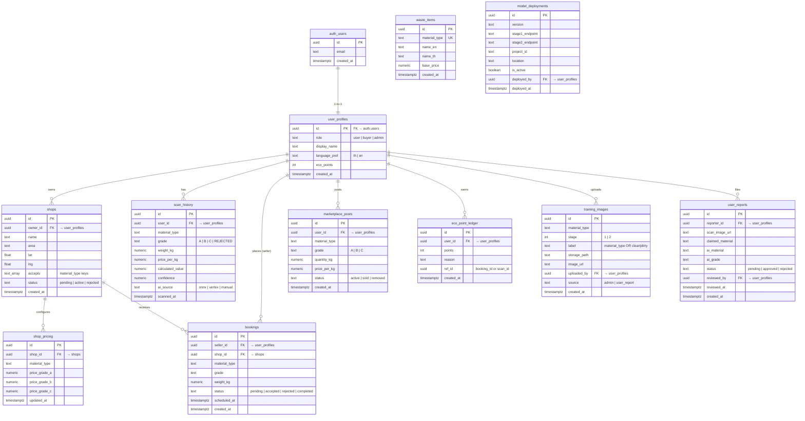
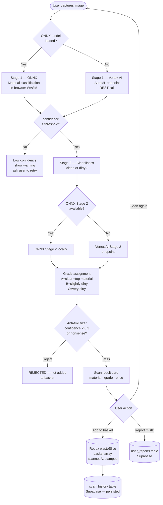
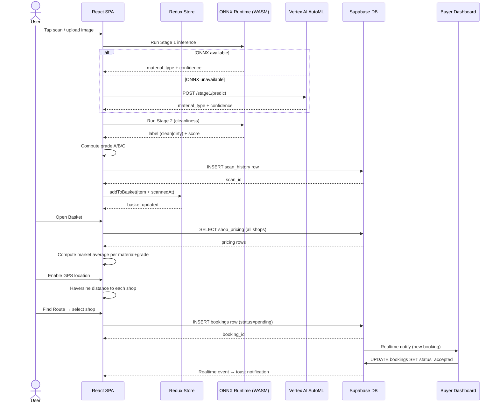
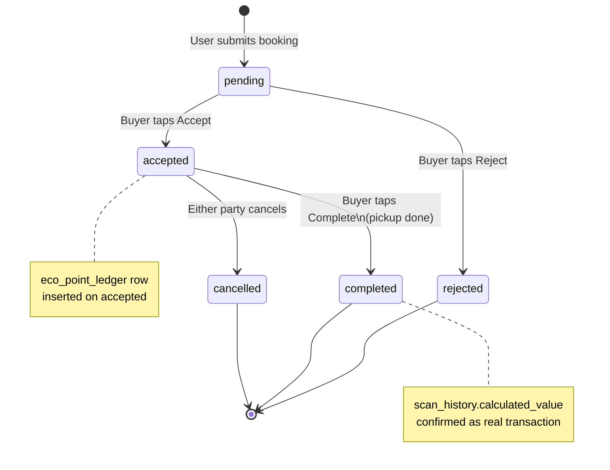
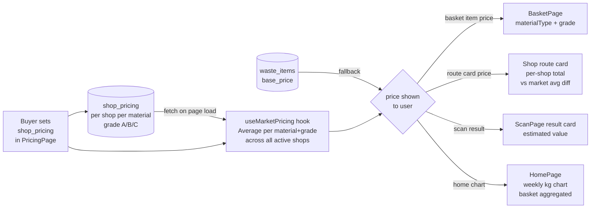
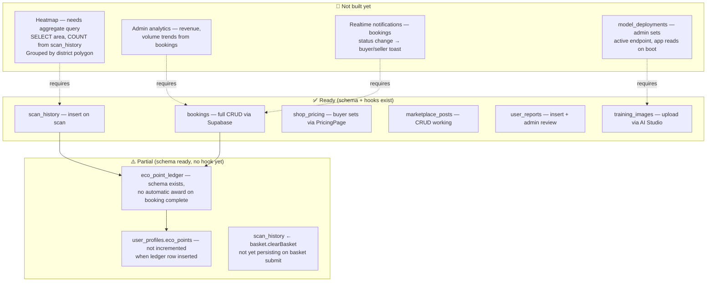
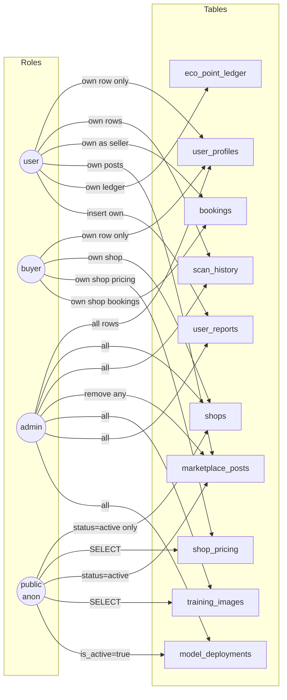

# GreenPlus AI — Data Flow & Architecture

> Reference document for data engineers. All diagrams use Mermaid (renders natively on GitHub).
> Last updated: 14 May 2026

---

## 1. Database Schema (ERD)

All tables live in `public` schema on Supabase PostgreSQL. Every table has Row Level Security enabled.

---

## 2. AI Inference Pipeline

Two-stage classification with priority: ONNX (local) → Vertex AI (cloud) → manual fallback.

---

## 3. Scan → Basket → Booking Data Flow

End-to-end sequence from camera tap to booking confirmed.

---

## 4. Booking State Machine

---

## 5. Pricing Data Flow

How prices flow from shop configuration to user display.

---

## 6. Frontend Architecture — Pages, Hooks & Redux

```mermaid
flowchart TB
    subgraph Auth["Auth Layer"]
        LoginPage
        ProtectedRoute
    end

    subgraph Layouts["Layouts"]
        UserLayout
        BuyerLayout
        AdminShell[Admin Shell]
    end

    subgraph UserPages["User Pages"]
        HomePage
        ScanPage
        BasketPage
        MapPage
        MarketplacePage
        EcoPointsPage
        ProfilePage
    end

    subgraph BuyerPages["Buyer Pages"]
        DashboardPage
        SchedulePage
        PricingPage
        NotificationsPage
    end

    subgraph AdminPages["Admin Pages"]
        AdminPage["AdminPage\n(shops · heatmap · reports · AI Studio)"]
    end

    subgraph Hooks["Supabase Hooks"]
        useAuth
        useShops
        useMarketPricing
        useSupabaseBookings
        useSupabaseMarketplace
        useUserReports
        useScanInsert
        useGPS
    end

    subgraph Store["Redux Slices"]
        userSlice["userSlice\nsession · profile · language"]
        wasteSlice["wasteSlice\nbasket · lastScan"]
        bookingSlice["bookingSlice\nbookings"]
        marketplaceSlice["marketplaceSlice\nposts"]
        scheduleSlice["scheduleSlice\nslots"]
        pricingSlice["pricingSlice\npricing rows"]
        notificationSlice["notificationSlice\nitems"]
        aiConfigSlice["aiConfigSlice\nmodelVersion · endpoints"]
    end

    LoginPage --> useAuth --> userSlice
    ScanPage --> useScanInsert --> wasteSlice
    BasketPage --> useShops & useMarketPricing & wasteSlice & bookingSlice
    MapPage --> useShops
    MarketplacePage --> useSupabaseMarketplace --> marketplaceSlice
    DashboardPage --> useSupabaseBookings --> bookingSlice
    SchedulePage --> useSupabaseBookings --> scheduleSlice
    PricingPage --> pricingSlice
    AdminPage --> useShops & useUserReports & aiConfigSlice
    HomePage --> wasteSlice & userSlice & useShops
```

---

## 7. Data Engineer Work Breakdown

Areas that need real data pipelines built out:

---

## 8. Row Level Security Policy Map

Who can read/write each table.

